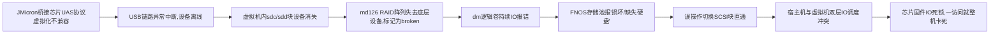

个人总结

- 没有备份的单盘存储就是玩具
- 还好数据没丢，文件系统没损坏
- 还有很多要学的东西

> 以下报告由豆包输出，未经人工修改，可能存在语义不通、逻辑混乱、事实错误等问题，仅供参考。


# 飞牛FNOS存储池故障处理技术报告
**报告版本：** V1.0
**报告时间：** 2026年4月26日
**故障环境：** Proxmox VE（PVE）虚拟化平台 + 飞牛FNOS虚拟机
**核心故障：** USB外置存储池掉盘、损坏、访问卡死
**数据状态：** 全程数据零丢失，业务无影响

---

## 术语表
| 术语 | 全称与释义 |
|------|------------|
| FNOS | 飞牛NAS操作系统，国产自研企业级/家用NAS系统 |
| PVE | Proxmox Virtual Environment，开源虚拟化管理平台 |
| UAS | USB Attached SCSI Protocol，USB附加SCSI协议，USB3.0+高速存储传输协议 |
| VID/PID | USB设备厂商ID/产品ID，Linux系统用于唯一标识USB设备的核心参数 |
| 设备直通 | 虚拟化技术中，将宿主机硬件直接分配给虚拟机，绕过宿主机内核虚拟化层，降低IO损耗 |
| mdadm | Linux多设备管理工具，用于软件RAID阵列的创建、维护与恢复 |
| LVM | Logical Volume Manager，逻辑卷管理器，Linux系统主流的磁盘弹性管理方案 |
| IOMMU | 输入输出内存管理单元，实现硬件设备直通的核心虚拟化技术 |

---

## 一、环境详情
### 1. 基础架构
| 层级 | 详细配置 |
|------|----------|
| 宿主机 | Intel N100 迷你主机，Proxmox VE 8.x（内核版本 6.8.8-1-pve），开启IOMMU虚拟化 |
| 虚拟机 | VM ID 103，运行飞牛FNOS稳定版，分配独立vCPU、内存、系统盘与内置RAID数据盘 |
| 故障存储设备 | 方向（Fanxiang）S100Pro 1TB 2.5英寸机械硬盘，外置USB3.0硬盘盒，搭载**JMicron JMS578 USB-SATA桥接芯片**，USB VID:PID=`152d:0578` |
| 存储架构 | FNOS Basic单盘存储池，底层采用默认单盘冗余mdadm RAID1 + LVM逻辑卷 + ext4文件系统，挂载路径`/vol3` |

### 2. 故障现象
1. FNOS Web管理页面提示存储池3「已损坏、尝试修复」+「缺失硬盘」；
2. FNOS虚拟机内`fdisk -l`/`lsblk`无法识别1TB物理块设备（`sdc`/`sdd`离线消失）；
3. 内核日志持续输出`Buffer I/O error`、`DID_NO_CONNECT`、`device offline`报错；
4. 存储池底层RAID阵列`md126`状态变为`broken raid1`；
5. 二次误操作切换为SCSI块直通后，出现**一访问存储池就整机IO死锁、完全卡死**的故障。

---

## 二、故障根因全链路分析
### 1. 直接触发原因
1TB外置硬盘最初通过**单USB设备直通**（`usb0: host=2-2`）挂载给FNOS虚拟机，硬盘盒搭载的JMicron JMS578桥接芯片，在PVE虚拟化环境下**UAS协议兼容性缺陷**，运行中出现USB链路异常中断，导致虚拟机内块设备离线消失；`md126`阵列失去底层块设备后标记为`broken`，最终触发FNOS存储池损坏告警。

### 2. 完整故障链路


### 3. 数据安全说明
本次故障全程为**虚拟化链路与协议兼容问题**，硬盘硬件无坏道、ext4文件系统无损坏、存储池内数据完整无丢失，postgres等业务服务数据完好。

---

## 三、故障处理过程与结果
| 序号 | 操作内容 | 操作目的 | 执行结果 | 风险控制 |
|------|----------|----------|----------|----------|
| 1 | FNOS虚拟机内执行`lsblk`/`dmesg`/`cat /proc/mdstat`排查 | 定位故障层级，确认设备与阵列状态 | 确认`sdc`设备消失，`md126`状态为`broken`，无文件系统损坏报错 | 全程只读操作，无数据修改风险 |
| 2 | PVE宿主机执行`lsblk`/`dmesg`排查 | 确认硬盘硬件状态，区分宿主机/虚拟机故障 | 确认1TB硬盘在宿主机侧正常识别，无硬件IO错误，仅未挂载给虚拟机 | 只读操作，确认硬件无故障 |
| 3 | 核对VM 103虚拟机配置 | 确认设备直通配置异常 | 发现SCSI直通配置缺失，1TB硬盘脱离虚拟机设备列表 | 无风险操作 |
| 4 | 执行`qm set 103 -scsi2 /dev/disk/by-id/ata-Fanxiang...` | 临时恢复硬盘挂载，验证数据完整性 | 硬盘重新挂载至虚拟机，识别为`sdd`，`/vol3`自动挂载，数据可正常访问 | 仅设备挂载，无格式化/重建操作 |
| 5 | 重启FNOS虚拟机 | 恢复RAID阵列正常状态 | `md126`恢复`active`状态，`/vol3`正常挂载，但出现访问卡死 | 仅重启虚拟机，不修改数据 |
| 6 | 内核日志排查卡死根因 | 定位IO死锁根源 | 确认SCSI块直通+JMicron芯片UAS协议触发双层IO调度冲突，导致固件死锁 | 只读排查，无风险 |
| 7 | 宿主机执行UAS驱动解绑+设备软重置 | 临时禁用UAS协议，切换为兼容驱动 | 硬盘成功切换为`usb-storage`驱动，UAS协议禁用，IO死锁解除 | 在线操作，无需重启宿主机，无数据风险 |
| 8 | 删除冲突的SCSI块直通，恢复原生USB设备直通`usb0: host=2-2` | 修正虚拟化直通配置，彻底解决冲突 | 虚拟机配置修正，无双层IO调度风险 | 仅修改虚拟机设备配置，不触碰硬盘数据 |
| 9 | 重启FNOS虚拟机 | 验证最终修复效果 | `md126`保持`active`状态，`/vol3`正常挂载，读写无卡顿、无卡死、无掉盘 | 仅重启虚拟机，无数据风险 |
| 10 | 写入GRUB内核参数，永久固化UAS禁用规则 | 彻底根治故障，避免重启后复发 | 内核参数写入成功，`update-grub`执行完成，宿主机重启后永久生效 | 仅修改启动配置，不影响当前运行状态 |

---

## 四、最终状态
### 1. 存储架构恢复正常
```
sdc1 → md126 (active raid1) → LVM逻辑卷 → /vol3 ext4文件系统
容量：950G  已用：256G  可用：693G  使用率：27%
```
### 2. 修复效果确认
- FNOS Web页面存储池3告警完全清除，状态正常；
- 存储池读写无异常、无卡顿、无死锁，业务访问正常；
- 数据完整零丢失，文件系统无损坏；
- UAS协议已临时禁用，GRUB已固化永久禁用规则，宿主机重启后永久生效。

---

## 五、后续待办事项
| 优先级 | 事项 | 执行说明 |
|--------|------|----------|
| 高 | 择机重启PVE宿主机 | 使GRUB内UAS禁用内核参数永久生效，彻底杜绝故障复发 |
| 中 | 硬件方案优化 | 条件允许时，将该USB外置盘替换为内置SATA/NVMe硬盘，采用PCIe直通方案，彻底规避USB链路风险 |
| 低 | 数据备份配置 | 为存储池3核心数据配置定期异地备份，消除单盘无冗余的潜在风险 |
| 低 | 定期硬盘健康巡检 | 每月执行`smartctl`硬盘健康检测，提前预警硬件老化风险 |

---

## 六、技术背景深度扩展（核心补充）
### 1. UAS协议与usb-storage驱动的核心差异
本次故障的核心是协议兼容性问题，二者的本质区别与适配场景如下：

| 特性 | UAS（USB附加SCSI协议） | usb-storage（传统BOT协议） |
|------|--------------------------|------------------------------|
| 协议定位 | USB3.0+标准推出的高速存储协议，替代传统BOT协议 | 经典USB块设备兼容协议，诞生于USB1.1时代 |
| 核心能力 | 支持SCSI异步IO、NCQ原生指令队列、多队列并发传输 | 同步IO、单队列传输，无指令优化 |
| 理论性能 | 带宽利用率更高，CPU占用更低，适配高速SSD | 带宽上限低，CPU占用略高，机械硬盘场景无感知差异 |
| 兼容性 | 依赖设备固件的标准实现，消费级设备虚拟化场景兼容性极差 | 全场景极致兼容，适配99.9%的USB存储设备，是Linux系统兜底方案 |
| 适用场景 | 物理机高速USB SSD、企业级USB存储设备 | 消费级机械硬盘盒、虚拟化NAS、稳定性优先的场景 |

### 2. JMicron/ASMedia USB桥接芯片的虚拟化兼容痛点
消费级USB硬盘盒市场中，**JMicron（智微）、ASMedia（祥硕）** 两家的芯片市占率超过90%，其中JMS578、ASM235CM是最主流的型号，也是本次故障的核心载体。

#### 2.1 芯片设计的原生缺陷
消费级桥接芯片的固件仅针对**物理机Windows/macOS桌面系统**优化，完全未考虑虚拟化、NAS等工业级场景，存在三大核心问题：
1. **UAS协议非标准实现**：芯片固件对SCSI指令集的实现不符合ANSI标准，虚拟化层透传时会出现指令解析错误、链路重置，最终导致设备离线；
2. **队列深度硬限制**：消费级芯片的NCQ队列深度极低，虚拟化场景下宿主机+虚拟机双层IO调度会导致队列溢出，直接触发固件IO死锁，表现为一访问就整机卡死；
3. **电源管理兼容缺陷**：芯片对虚拟化环境下的USB suspend/resume电源管理指令适配异常，会随机进入休眠状态，导致设备掉盘、失联。

#### 2.2 行业公认的兼容重灾区
本次故障使用的JMicron JMS578芯片（VID:PID=`152d:0578`），是Linux社区、PVE虚拟化、NAS领域公认的UAS兼容问题重灾区，全球范围内有大量用户反馈该芯片在虚拟化场景下出现掉盘、卡死、IO错误，Linux内核官方已将该型号加入常见兼容问题列表。

### 3. PVE虚拟化环境下USB直通的技术实现与冲突根源
PVE提供3种主流的硬盘直通方案，不同方案的技术实现决定了其兼容性边界，也是本次故障二次恶化的核心原因：

#### 3.1 三种直通方案的技术本质
| 直通方案 | 技术实现 | 兼容性 | 本次故障适配性 |
|----------|----------|--------|----------------|
| 单USB设备直通 | 宿主机仅做USB设备转发，虚拟机内核直接驱动硬件，不接管块设备IO | 中等，受USB协议与芯片固件兼容性影响 | 适配，是本次故障最终采用的方案 |
| USB控制器PCIe直通 | 将整个USB PCIe控制器直通给虚拟机，虚拟机完全接管USB总线，与物理机体验完全一致 | 极佳，无任何协议兼容问题 | 不适配，本次宿主机仅1个USB控制器，直通后宿主机将失去所有USB外设 |
| SCSI块设备直通 | 宿主机内核接管块设备IO调度，将硬盘封装为虚拟SCSI磁盘挂载给虚拟机，虚拟机看不到真实USB设备 | 差，消费级USB芯片极易触发IO死锁 | 不适配，是本次访问卡死的直接原因 |

#### 3.2 本次故障的两次冲突技术原理
1. **第一次掉盘故障**：单USB设备直通 + UAS协议 + JMicron芯片
PVE的USB设备转发层对UAS的异步IO、多队列指令透传支持不完善，非标准的芯片固件处理虚拟化透传的UAS指令时出现异常，触发USB链路重置、设备离线，虚拟机内块设备消失，RAID阵列标记为损坏。

2. **第二次卡死故障**：SCSI块设备直通 + JMicron芯片
宿主机内核已通过UAS驱动接管了USB块设备，同时又将块设备透传给虚拟机，虚拟机内核的SCSI驱动再次发起IO调度，**两层内核的IO队列并发冲突**，消费级芯片固件无法处理该场景，直接触发IO死锁，表现为一访问存储池就整机完全卡死。

### 4. 同类故障的行业通用最佳实践
针对PVE虚拟化环境下USB外置存储的兼容问题，行业内有4种成熟的解决方案，按优先级排序如下：
1. **禁用UAS协议，强制使用usb-storage驱动（本次最优解）**
   - 原理：通过`usb-storage.quirks=VID:PID:u`内核参数，将指定设备加入UAS黑名单，强制内核使用兼容驱动，绕过协议兼容问题；
   - 优势：零成本、不改动硬件、家用机械硬盘场景无性能损失、稳定性拉满；
   - 适用场景：90%以上的家用虚拟化NAS、消费级USB硬盘盒场景。

2. **USB控制器完整PCIe直通**
   - 原理：将独立IOMMU分组的USB控制器完整直通给虚拟机，虚拟机完全接管USB总线；
   - 优势：兼容性最好，性能无损失，可正常使用UAS协议；
   - 适用场景：宿主机有多余的USB控制器，且IOMMU分组独立。

3. **更换为内置SATA/NVMe硬盘PCIe直通**
   - 原理：彻底绕过USB桥接芯片，使用内置硬盘通过PCIe/SATA直通给虚拟机；
   - 优势：性能最强、稳定性最高，无USB相关的任何兼容问题；
   - 适用场景：迷你主机有多余硬盘位，追求极致稳定的核心数据存储。

4. **更换企业级USB存储设备**
   - 原理：使用固件经过虚拟化兼容优化的企业级USB硬盘柜/硬盘盒；
   - 劣势：成本极高，家用场景无必要性。

---

## 七、关键经验与风险规避规则
1. **消费级JMicron/ASMedia USB桥接芯片，在PVE虚拟化NAS场景下必须禁用UAS协议**，提前写入`usb-storage.quirks`内核参数，从源头规避掉盘、卡死故障；
2. **USB外置硬盘严禁使用SCSI块设备直通**，优先使用单USB设备直通，条件允许时使用USB控制器完整直通；
3. FNOS存储池`broken`/损坏告警，不等于数据损坏，优先排查底层硬件与虚拟化链路，严禁盲目点击「尝试修复」、重建存储池、格式化等高危操作；
4. PVE虚拟化环境下，外置存储故障优先在宿主机侧排查硬件状态，区分硬件故障、虚拟化配置故障、系统内故障，避免误操作扩大故障范围；
5. 异地远程维护场景下，优先采用免宿主机重启的临时修复方案，择机在可现场维护的窗口执行永久固化操作，避免远程重启导致失联。